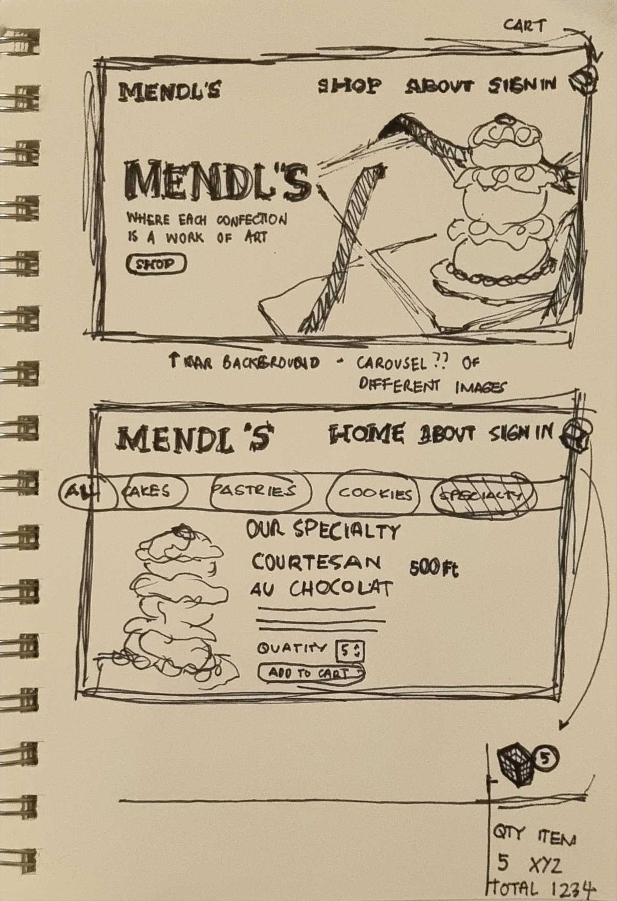
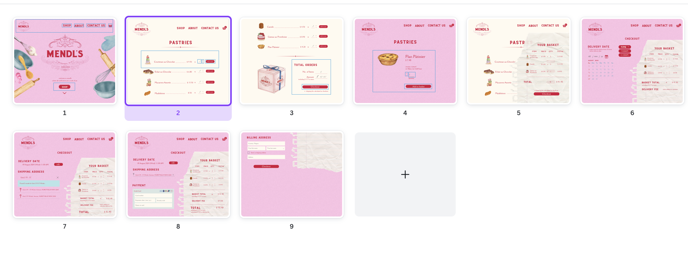
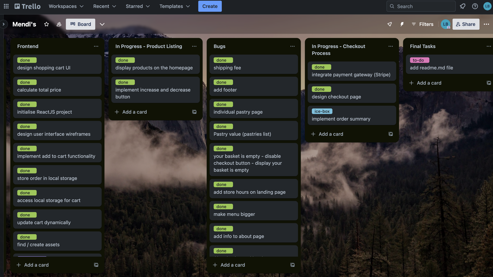
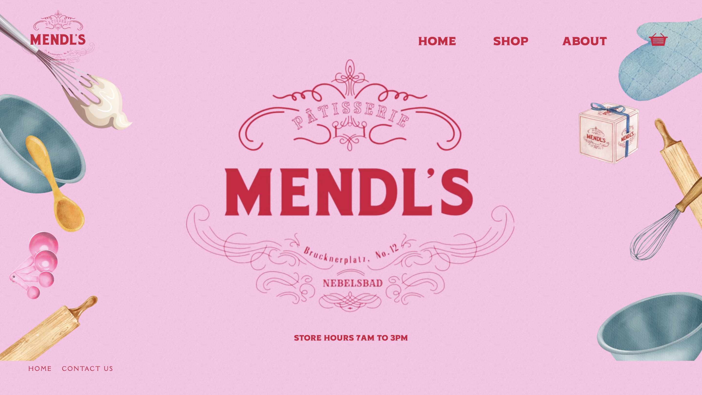
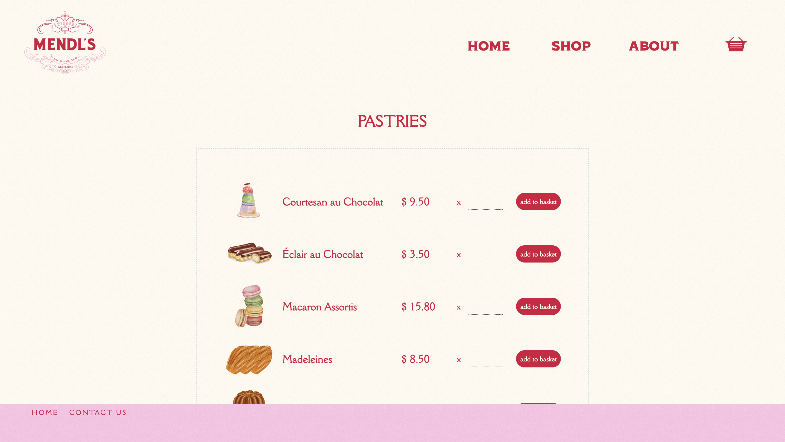
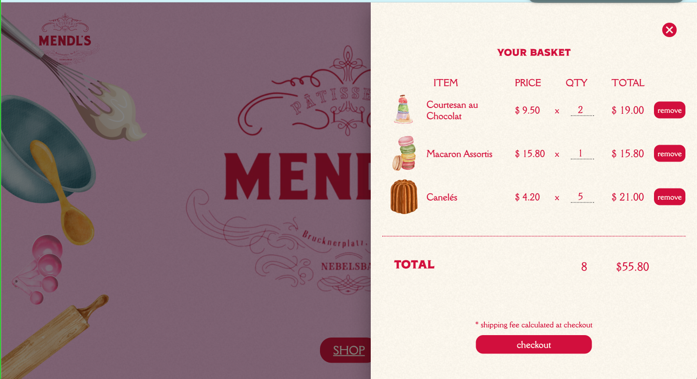
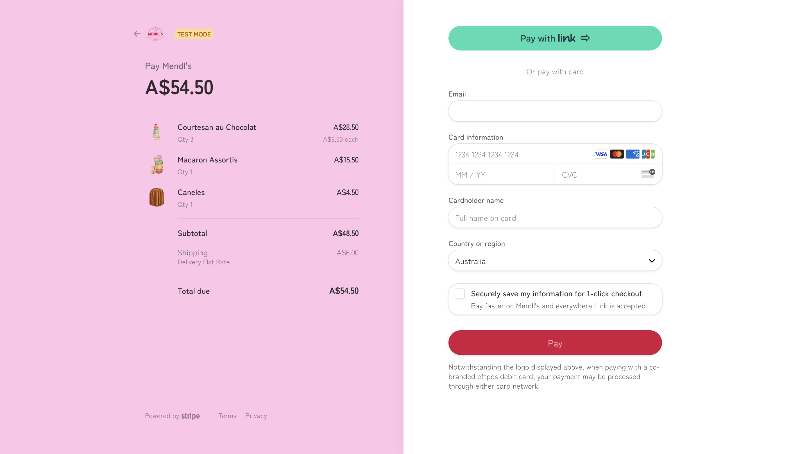

# Mendl's

Mendls is a SPA built using ReactJS. It is an online pastry shop inspired by the movie The Grand Budapest Hotel. It's features include a dynamic shopping basket
that is in snyc with the shop menu / pastries section. It also has payment proccesing hosted by Stripe. 

### Technologies Used
- NodeJS, ExpressJS, PostgreSQL
- ReactJS, Stripe, Material UI 
- HTML, CSS, JavaScript

### Approach

I first chose the theme for the website, as I work better when I have a solid
idea of how the project will look like and this allowed me to identify the
data structure that I will need. Planning included wireframing, setting up a Trello board to keep track of tasks, accumulating assets and researching libraries / modules that are useful to the website. Then, I created the backend database using PostgreSQL and the endpoints I needed to send the data to the client side. After setting up the backend, I proceeded to create the client side utilising ReactJS and creating checkout sessions using Stripe.

### Lessons Learnt

- Planning pays off but not everything goes wtih the plan. Planning allowed me to finish the website earlier than expected even when some libraries I planned to use turned out to be more complicate than I thought or did not work well with the project. Hence, in some cases I had to regroup and find alternatives in order to accomplish some features.

- As stated above, you have to be adaptable.

### Future Features

- Add Google Maps AutoComplete to delivery address collection
- Allow users to sign up and log in or log out
- Data validation / authorisation

